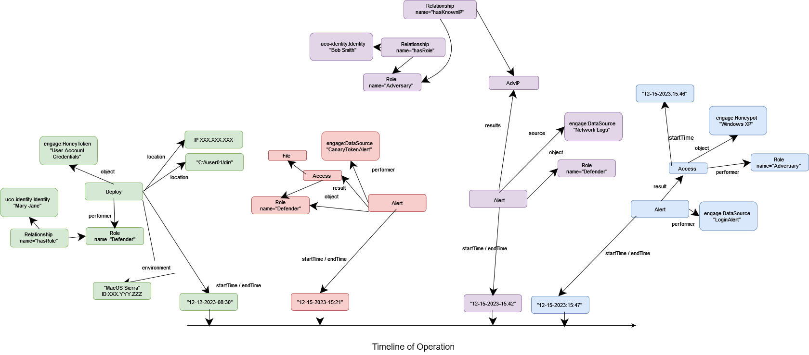

# Operational Honeypot Narrative Example

The usage of this example is to demonstrate how events during a deception operation will appear in regards to a timeline with datetime properties.



### 1. Event 1 (highlighted in green)

The first Deploy action is representative of "def-deploy-honeytoken" as outlined in the narrative version. This action represents that on 12-12-2023-08:30, a defender deployed honeytoken credentials at a certain location and IP inside of an accessible, public file.

### 2. Event 2 (highlighted in red)

The first Alert action describes when the first automated generated report or notification from a data source which indicates that a certain file was opened. This does not guarentee that the user will use or knows of the honeytoken, but we know the file has been opened.

### 3. Event 3 (highlighted in purple)

The third alert from a network data source is generated when an adversary known IP or unknown IP ping sweeps the honeypot. Here, we do not necessarily know if this was intentional from the laid honeytoken, but we know they might try to gain direct access.

### 4. Event 4 (highlighted in blue)

The last alert is generated when the internal logging system of the honeypot reports that a user successfully or unsuccessfully logged onto the system. Here, given we can inspect the logs afterward, we can be certain whether or not the honeytoken was successful. Furthermore, the end goal was to reach the honeypot and therefore despite whatever method, depending on the objective of the deception operation, this can be considered successful or not.


```python

```
