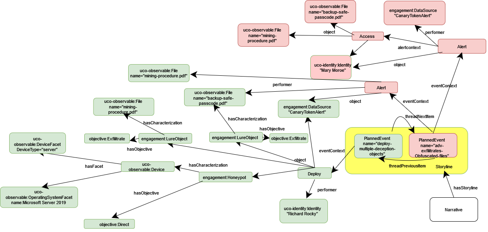

# Small Business Example


```python
# This software was produced for the U.S. Government under contract FA8702-23-C-0001,
# and is subject to the Rights in Data-General Clause 52.227-14, Alt. IV (DEC 2007)
# ©2023 The MITRE Corporation. Published under the Linux Foundation’s Cyber Domain Ontology project’s Apache 2 license.
# Released under MITRE PRS 18-4297.
```

After checking out the specific class instantiation tutorial examples such as `Honeypot`, `FluidDeception` and `Breadcrumb`, we believe enumerating through an application example can help our audience understand how AEO can represent and support a deception operation.

# Premise

- You are part of a small business called <b> MineralRUs Inc.</b>, which is a small, yet critical mining company in New Hampshire specializing in rare earth elements.
- Your main clients are from particular sectors of technology and defense industries, and are considered to be critical infrastructure. Therefore, your business and its operation is essential to the integrity of supply chains enabling those critical infrastructure.
- MineralRUs Inc. maintains paper-based record of their key intellectual property and operational procedures, which are stored in a physical safe. This fact is known by only a select few in the company.
- Your business has a small, unorganized computer network with only generic security infrastructure, and the company does not have the resources to employ an in-house information security team. Instead, a very small team is tasked with maintaining Operational Technology (OT) systems on the network.

Your company has recently received an advisory from federal authorities, warning businesses in your industry about the rapidly growing threat of cyber espionage by state-sponsored Advanced Persistent Threats (APTs). In response, your company decides to engage an external cybersecurity provider to assist with timely incident response and prevention. The external provider recommends the employment of active adversary engagement plans, and asks you to develop a high-level deception and denial strategy.

## Preplanning & Indentifying Assets

To get started with the planning of this adversary engagement operation, we begin with an existing tool, namely the <b> Fact&Fiction/(D&D) matrix </b>. The original matrix uses Deception & Denial (D&D) technique types as the row header (for more details, see [Heckman, K. E., et al. (2015), Denial and deception in cyber defense.](https://www.researchgate.net/publication/275270540_Denial_and_Deception_in_Cyber_Defense)

The <b> row header </b> outlines two types of methods that concurrently facilitate adversary engagement: <b>misleading-type methods used to reveal specific information to an adversary and ambiguity-type methods for concealing or denying information from an adversary </b>. The ambiguity-type methods for denial can be used to safe-guard assets through confusion and obfuscation, thus impeding an adversary's efforts to obtain a clear view of relevant resources and access paths. On the other hand, the misleading-type methods aim to induce a desired (mis)perception of the cyber ecosystem through the controlled revelation of real or fabricated information to an adversary.


The <b> column header </b> refers to the <b> value of information </b> an adversary gains from some revealed event. In this specific method, fact is used to describe the asset information and fiction specifically implies the intended (mis)perception of such information. 


[remove?] Generally speaking, we do not specify actual values, but comparative concepts such as high-value, low-value or no-value in relationship with the deception operation and the expectation of value an adversary justifies for expending resources for. Extension to numerical values can be done, but is not within the scope of this example. 

|| Deception Operation Mislead-type Methods (Revealing) | Denial Operation Ambiguity-type Methods (Concealing) |
|---| --- | --- |
|Fact | Network in New Hampshire, business runs a mine in New Hampshire | Business relationships with a specific strategic partner, types of minerals mined given to the strategic partner, process of mineral mining that is essential to the strategic partner, amounts of mined minerals for the strategic partner, company safe location, passcodes, locations of IP keys|
|Fiction | low-value IP is stored on the network, contained within falsified, obfuscated files | Most important IP is located in <i> this </i> specific encrypted volume |

1. The fiction under the Deception Operation column refers to presenting to an adversary that there is low-value intellectual property on the network such as referencing perhaps other types of non-confidential mineral mining processes and outdated contracts with public partners.

2. The fact under Deception Operation refers to bits of factual but so called friendly information that can help bring realism to the deception operation and allow adversaries to validate some mutual information to minimize inconsistencies in the perception.

3. The fiction under the Denial Operation refers to giving the adversary the perception that it is in the defender's interest for the network to conceal the location of the IP.

4. The fact under the Denial Operation refers to the information or assets the strategic partner would like to conceal such as their business relationships and exact details about the mining process and contracted amounts of minerals provided by MineralRUs.

By enumerating the assets of the business such as the intellectual property located in the safe and business operation details, we directly identify what information we would like to deny an adversary. Building on this analysis, we then decide on the appropriate adversary engagement tools and techniques for our deception and denial needs. 

At this point, we would like to raise a reminder that the AE ontology specializes in the characterization of deception and denial operations, but asset evaluation and risk profiling are outside the scope of this work. Such concepts and processes fall within the purview of the soon-to-come UCO Risk and Cyber Threat Intelligence (CTI) subontologies.


## From the Narrative to a Graph

The Adversary Engagement Ontology provides the structure needed to transform your abstract deception operation plan into graph representation. The degree of how detailed your `Narrative` depends on how extensively refined do you want your preoperation planning to be. 


### The Mapping Process

- 1. Start with a basic more or less static structure. Outline the sequence of planned events for the deception operation. Then comes the following iterative process:
    - 2.a Select deception techniques and objects according to the intended fiction (cf. Fact&Fiction matrix)
    - 2.b Evaluate the refinements: Does it deliver your desired fiction in the most feasible, effective and efficient manner?
    - 2.c If not, repeat 2.a and 2.b until satisfied.

### Diagram representation



In this diagram, the `Narrative` has very little `PlannedEvent(s)` within the `Storyline`. That's okay! Not all deception operations need to consider adversaries with straightforward access to the contents and artifacts of a network. Deception operations typically use just a subset of all the deception tools and tricks, particularly since the employment of each additional component comes with additional cost in terms of resources, risk, and operational integrity. In our example scenario of a small business, extremely complex forms of deception are deemed infeasible within their scope of available resources and risk models. 

- The class [`engagement:Honeypot`](https://aeontology.sail-lab.org/docs/class-engagementhoneypot.html) in this use case is used with the specific objective `objective:Direct` to lure an adversary away from the real assets of the network to this fictitious staged location. 

- Staged files are instantiated under the general [`engagement:LureObject`](https://aeontology.sail-lab.org/docs/class-engagementlureobject.html) class, though these can be fully real, partially real or completely facticious files. Furthermore, these `LureObject(s)` are associated with the objective `objective:Exfiltrate` which implies that these files are intended to be taken by an adversary off the network. (More complex representations may include instances associated with attack patterns for an adversary with the same objective.)

- The method which we plan to be notified whether these files were removed from the network is through a canary token, however one can have other `DataSource(s)` such as a network monitor.

## Building the JSON-LD:

1. As with all `Narrative(s)`, we start with instantiating an [`engagement:Narrative`](https://aeontology.sail-lab.org/docs/class-engagementnarrative.html) class which is often referred to as a deception campaign and is the collection of all storylines . We also specify a large-scale operational objective to the Narrative object. This instance of an [`engagement:Narrative`](https://aeontology.sail-lab.org/docs/class-engagementnarrative.html) only has one instance of a [`engagement:Storyline`](https://aeontology.sail-lab.org/docs/class-engagementstoryline.html) attached since we have only developed one plan so far. However, we can model this with multiple `Storyline(s)` if we wanted to separate each falsified file as its own `Storyline`.
2. An objective can be attached to describe large-scale operational objectives. Explicit objectives are considered individual, so please remember that!


```python
{
  "@id": "kb:narrative1",
  "@type": "engagement:Narrative",
  "engagement:hasStoryline": [
    {
      "@id": "kb:storyline1",
      "@type": "engagement:Storyline",
      "uco-core:name": "ProtectTheFilesNarrative"
    }
  ],
  "objective:hasObjective": [
    {
      "@id": "kb:objective1",
      "@type": "objective:Objective",
      "uco-core:name": "ProtectTheFiles"
    }
  ],
  "uco-core:description": "Grand objective is to lure adversaries or insiders on the network away from details of the mining operations, location and passcode of the safe containing intellectual property."
}
```


    {'@id': 'kb:narrative1',
     '@type': 'engagement:Narrative',
     'engagement:hasStoryline': [{'@id': 'kb:storyline1',
       '@type': 'engagement:Storyline',
       'uco-core:name': 'ProtectTheFilesNarrative'}],
     'objective:hasObjective': [{'@id': 'kb:objective1',
       '@type': 'objective:Objective',
       'uco-core:name': 'ProtectTheFiles'}],
     'uco-core:description': 'Grand objective is to lure adversaries or insiders on the network away from details of the mining operations, location and passcode of the safe containing intellectual property.'}


3. Next, to populate the sequence of `PlannedEvent(s)`for a our instance of [`engagement:Storyline`](https://aeontology.sail-lab.org/docs/class-engagementstoryline.html), we add an event, let's call it `kb:Event1`.
4. Each instance of [`PlannedEvent`](https://aeontology.sail-lab.org/docs/class-engagementplannedevent.html) is designed to have an action class e.g. `engagement:Deploy` by the [`engagement:eventContext`](https://aeontology.sail-lab.org/docs/prop-engagementeventcontext.html) property. By design, action concepts like `Deploy` can support properties such as `performers`, `object`, `environment` etc because of its parent class `uco-action:Action`.
5. In this explicit case, the `object` that is `Deploy`(ed) is an instance of a [`engagement:Honeypot`](https://aeontology.sail-lab.org/docs/class-engagementhoneypot.html) with the specific objective of `objective:Direct`, implying the honeypot is used to direct adversaries to or away from other assets on the network.


```python
{
  "@id": "kb:Event1",
  "@type": "engagement:PlannedEvent",
  "engagement:eventContext": [
    {
      "@id": "kb:deploy1",
      "@type": "engagement:Deploy",
      "uco-action:object": [
        {
          "@id": "kb:honeypot1",
          "@type": "engagement:Honeypot",
          "uco-core:description": "Fake production server to contain the fabricated files.",
          "objective:hasObjective": [
            {
              "@id": "objective:Direct"
            } 
            ]

        }]
}]
}
```


    {'@id': 'kb:Event1',
     '@type': 'engagement:PlannedEvent',
     'engagement:eventContext': [{'@id': 'kb:deploy1',
       '@type': 'engagement:Deploy',
       'uco-action:object': [{'@id': 'kb:honeypot1',
         '@type': 'engagement:Honeypot',
         'uco-core:description': 'Fake production server to contain the fabricated files.',
         'objective:hasObjective': [{'@id': 'objective:Direct'}]}]}]}


6. Besides an instance of a [`engagement:Honeypot`](https://aeontology.sail-lab.org/docs/class-engagementhoneypot.html) and the CanaryTokenAlert `dataSource`, two deception objects namely the obfuscated, falsified files were deployed during the first `PlannedEvent`. Both files `kb:obffile1` and `kb:obffile2` are an instances of a [`engagement:LureObject`](https://aeontology.sail-lab.org/docs/class-engagementlureobject.html) with the explicit objective `objective:Exfiltrate` of being exfilitrated from the network by adversaries. The first file being false information on the mining procedures used by the business and the second file refers to false passcodes in case the adversary happens to be an insider.


```python
{
  "@id": "kb:obffile1",
  "@type": "engagement:LureObject",
  "uco-core:name": "mining-procedure.pdf",
  "uco-core:description": "Fake file of mining procedures.",
  "objective:hasObjective": [
    {
      "@id": "objective:Exfilitrate"
    } 
    ]
},
{
  "@id": "kb:obffile2",
  "@type": "engagement:LureObject",
  "uco-core:name": "backup-safe-passcode.pdf",
  "uco-core:description": "Fake file of safe passcode and physical location of the safe.",
  "objective:hasObjective": [
    {
      "@id": "objective:Exfiltrate"
    } 
    ]
}
```


    {'@id': 'kb:obffile2',
     '@type': 'engagement:LureObject',
     'uco-core:name': 'backup-safe-passcode.pdf',
     'uco-core:description': 'Fake file of safe passcode and physical location of the safe.',
     'objective:hasObjective': [{'@id': 'objective:Exfiltrate'}]}


7. We also know who is going to `Deploy` the deception objects so we should also include that through the `performer` property.
8. We also attach an objective the `Deploy` action.


```python
{"uco-action:performer": [
{
  "@id": "kb:person1",
  "@type": "uco-identity:Person",
  "uco-core:hasFacet": [
    {
      "@id": "kb:RichardRocky",
      "@type": "identity:SimpleNameFacet",
      "uco-identity:familyName": "Richard",
      "uco-identity:givenName": "Rocky"
    }
  ]
}
],
"objective:hasObjective": [
{
  "@id": "objective:Deploy"
}
]
}
```


    {'uco-action:performer': [{'@id': 'kb:person1',
       '@type': 'uco-identity:Person',
       'uco-core:hasFacet': [{'@id': 'kb:RichardRocky',
         '@type': 'identity:SimpleNameFacet',
         'uco-identity:familyName': 'Richard',
         'uco-identity:givenName': 'Rocky'}]}],
     'objective:hasObjective': [{'@id': 'objective:Deploy'}]}


9. The first instance of [`PlannedEvent`](https://aeontology.sail-lab.org/docs/class-engagementplannedevent.html) describes the deployment of the deception objects onto the network. Now we continue to what we expect to happen in the next `PlannedEvent` called `kb:Event2`. We left the property [`eventContext`](https://aeontology.sail-lab.org/docs/prop-engagementeventcontext.html) with `...` because this needs to be expanded, but we will get to that in the next step. 


```python
{
      "@id": "kb:Event2",
      "@type": "engagement:PlannedEvent",
      "engagement:eventContext": [...],
      "uco-core:name": "adv-exfiltrates-Obfuscated-files"
    }
    
```

10. The first thing we expect is an action that is partially-observable, but not entirely. In this case, we do not actually know if a file is exfiltrated until we are alerted by our `dataSource` that it recieved a signal from the obfuscated file through the canarytoken. We include an instance of `Alert` to represent the relationship between the CanaryTokenAlert system and the obfuscated files which we are able to deduce.


```python
 {
          "@id": "kb:alert0",
          "@type": "engagement:Alert",
          "uco-action:performer": [            
                {
                  "@id": "kb:obffile1"
                },
                {
                  "@id": "kb:obffile2"
                },
                {
                  "@id": "kb:file1",
                  "@type": "uco-observable:File",
                  "uco-core:name": "backup-safe-passcode.pdf",
                  "uco-core:hasFacet": [
                    {
                      "@id": "kb:filefacet1",
                      "@type": "uco-observable:FileFacet",
                      "observable:filename": "backup-safe-passcode.pdf"
                    }
                  ]
                },
                {
                  "@id": "kb:file2",
                  "@type": "uco-observable:File",
                  "uco-core:name": "mining-procedure.pdf",
                  "uco-core:hasFacet": [
                    {
                      "@id": "kb:filefacet1",
                      "@type": "uco-observable:FileFacet",
                      "observable:filename": "mining-procedure.pdf"
                    }
                  ]
                }
          ],
          "uco-action:object": [            
            {
              "@id": "kb:DataSource1",
              "@type": "engagement:DataSource",
              "uco-core:name": "CanaryTokenAlert"
            }
          ]
 }
```

11. The second thing we expect is to be alerted by some data source. Then, the action class we will use to describe this is an instance of [`Alert`](https://aeontology.sail-lab.org/docs/class-engagementalert.html). The `performer` for this instance of [`Alert`](https://aeontology.sail-lab.org/docs/class-engagementalert.html) is not going to be a person or identity, but rather an [`engagement:DataSource`](https://aeontology.sail-lab.org/docs/class-engagementdatasource.html) we call CanaryTokenAlert.
12. The `object` property of `Alert` would be an identity such as a person such as our deployer, Richard Rocky.
13. The attached objective to this action is `objective:Detect` because the usage of an alert is to inform a defender or identity of an event.


```python
{
  "@id": "kb:alert1",
  "@type": "engagement:Alert",
  "engagement:alertContext": [...],
  "uco-action:object": [
    {
      "@id": "kb:person1"
    }
  ],
  "uco-action:performer": [
    {
      "@id": "kb:DataSource1",
      "@type": "engagement:DataSource",
      "uco-core:name": "CanaryTokenAlert"
    }
  ]
}

```

14. We now expand the property `alertContext` to describe what this explicit alert implies about an occurence. By design, we expect to see another action such as `Access` since the alert informed us that one of the falsified files were accessed. 
15. Unified Cyber Ontology (UCO) explicitly has a class called `uco-observable:File` which we use to instantiate the UCO object itself with an attached facet `uco-observable:FileFacet`. We reference the `kb:obffile1` instance with the property `object`.

`kb:obffile1`


```python
{
"engagement:alertContext": [
{
  "@id": "kb:access1",
  "@type": "engagement:Access",
  "uco-action:object": [
    {
      "@id": "kb:obffile1",
    },
    {
      "@id": "kb:file1",
      "@type": "uco-observable:File",
      "uco-core:name": "backup-safe-passcode.pdf",
      "uco-core:hasFacet": [
        {
          "@id": "kb:filefacet1",
          "@type": "uco-observable:FileFacet",
          "observable:filename": "backup-safe-passcode.pdf"
        }
      ]
    }
  ],
  "uco-action:performer": [...]
}
]
}
```

16. We then repeat the process for `kb:obffile2`. Additionally, we expect the `performer` of the `Access` action to be a specific person, namely Mary Moroe. This is because she is the only other person that is aware of the physical safe and has a privilege user account that would have user account access to view this file.

`kb:obffile2`


```python
{
"engagement:alertContext": [
{
  "@id": "kb:access1",
  "@type": "engagement:Access",
  "uco-action:object": [
    {
      "@id": "kb:obffile2"
    },
    {
      "@id": "kb:file2",
      "@type": "uco-observable:File",
      "uco-core:name": "mining-procedure.pdf",
      "uco-core:hasFacet": [
        {
          "@id": "kb:filefacet1",
          "@type": "uco-observable:FileFacet",
          "observable:filename": "mining-procedure.pdf"
        }
      ]
    }
  ],
  "uco-action:performer": [
        {
          "@id": "kb:person2",
          "@type": "uco-identity:Person",
          "uco-core:hasFacet": [
            {
              "@id": "kb:MaryMoroe",
              "@type": "identity:SimpleNameFacet",
              "uco-identity:familyName": "Mary",
              "uco-identity:givenName": "Moroe"
            }
          ]
        }
  ]
}
]
}
```

17. Now that the [`PlannedEvent`](https://aeontology.sail-lab.org/docs/class-engagementplannedevent.html) is complete, we now need to ensure that the `PlannedEvent(s)` can be used as a sequence of events tied to the [`engagement:Storyline`](https://aeontology.sail-lab.org/docs/class-engagementstoryline.html). To do this, UCO has a specific class called `uco-types:Thread` which has the structure for supporting the concepts of sequential relationships.

18. Our explicit instance of [`engagement:Storyline`](https://aeontology.sail-lab.org/docs/class-engagementstoryline.html) uses a property called `hasEvent` to instantiate an instance of `uco-types:Thread`. The important properties of `uco-types:Thread` for our use case are: `co:element`, `co:item`, `co:size`, `uco-types:threadOriginItem`, `uco-types:threadTerminalItem`. We outline the necessary properties and will expand them separately.


```python
 {
  "@id": "kb:storyline1",
  "@type": "engagement:Storyline",
      "engagement:hasEvent": [
        {
          "@id": "kb:eventthread1",
          "@type": "uco-types:Thread",
          "co:element": [...],
          "co:item": [...],
          "co:size": {...},
          "uco-types:threadOriginItem": [...],
          "uco-types:threadTerminalItem": [...]
        }
      ]
 }
```


    {'@id': 'kb:storyline1',
     '@type': 'engagement:Storyline',
     'engagement:hasEvent': [Ellipsis]}


`co:element` refers to the elements of the `Thread` so in our case, they reference our instantiated `PlannedEvent(s)`: `kb:Event1` and `kb:Event2`


```python
 {"co:element": [
    {
      "@id": "kb:Event1"
    },
    {
      "@id": "kb:Event2"
    }
  ] }
```


    {'co:element': [{'@id': 'kb:Event1'}, {'@id': 'kb:Event2'}]}


`co:item` refers to the event as a thread item itself.


```python
 {

  "co:item": [
    {
      "@id": "kb:event-thread-item1"
    },
    {
      "@id": "kb:event-thread-item2"
    }
  ]}
```


    {'co:item': [{'@id': 'kb:event-thread-item1'},
      {'@id': 'kb:event-thread-item2'}]}


`co:size` refers to the number of thread items in the thread.


```python
{  "co:size": {
    "@type": "xsd:nonNegativeInteger",
    "@value": "2"
  }}
```


    {'co:size': {'@type': 'xsd:nonNegativeInteger', '@value': '2'}}


`uco-types:threadOriginItem` refers to the first thread item or source thread item.


```python
{  "uco-types:threadOriginItem": [
    {
      "@id": "kb:event-thread-item1"
    }
  ]}
```


    {'uco-types:threadOriginItem': [{'@id': 'kb:event-thread-item1'}]}


`uco-types:threadTerminalItem` refers to the last thread item which terminates the sequence of thread items.


```python
 {
  "uco-types:threadTerminalItem": [
    {
      "@id": "kb:event-thread-item2"
    }
  ]
    }
```


    {'uco-types:threadTerminalItem': [{'@id': 'kb:event-thread-item2'}]}


19. Finally, in the home stretch, we need to use `uco-types:ThreadItem` to create the chain of threads using the `uco-types:threadNextItem` property and `uco-types:threadPreviousItem` property. `kb:Event1` only uses the `threadNextItem` and `kb:Event2` only uses the `threadPreviousItem`.

`kb:Event1`


```python
{
      "@id": "kb:event-thread-item1",
      "@type": "uco-types:ThreadItem",
      "co:itemContent": {
        "@id": "kb:Event1"
      },
      "uco-types:threadNextItem": [
        {
          "@id": "kb:event-thread-item2"
        }
      ]
    }
```


    {'@id': 'kb:event-thread-item1',
     '@type': 'uco-types:ThreadItem',
     'co:itemContent': {'@id': 'kb:Event1'},
     'uco-types:threadNextItem': [{'@id': 'kb:event-thread-item2'}]}


`kb:Event2`


```python
{
  "@id": "kb:event-thread-item2",
  "@type": "uco-types:ThreadItem",
  "co:itemContent": {
    "@id": "kb:Event2"
  },
  "uco-types:threadPreviousItem": [
    {
      "@id": "kb:event-thread-item1"
    }
  ]
}

```


    {'@id': 'kb:event-thread-item2',
     '@type': 'uco-types:ThreadItem',
     'co:itemContent': {'@id': 'kb:Event2'},
     'uco-types:threadPreviousItem': [{'@id': 'kb:event-thread-item1'}]}


And voila! Your adversary engagement plan is now fully represented in a standardized knowledge graph using the AE ontology. 

# Querying a Graph

Now that we have a fully functional example which we can insert into a graph database, let's test some queries. We'll work with logistics for the narrative which can help in the development of more variance and variety of deception techniques used within the `Narrative`


```python
import rdflib
g = rdflib.Graph()
narrative_example = "SmallBusinessExample.jsonld"
g.parse(narrative_example)
```


    <Graph identifier=N3f6735a044f846e19ecfecb90e0d2179 (<class 'rdflib.graph.Graph'>)>


## [Q] How many deception objects were instantiated with the objective `engagement:Exfiltrate`?

It may be useful to know how many deception objects were deployed with the objective to be exfiltrated. For our example, it is relatively easy to deploy more obfuscated files on a network than scale up the number of highly functional honeypots on a network, therefore perhaps in a revision of the deception plan, more falsified files are placed on the network for more visibility.


```python
query = """
PREFIX co: <http://purl.org/co/>
PREFIX kb: <http://example.org/kb/>
PREFIX engagement: <https://ontology.adversaryengagement.org/ae/engagement/>
PREFIX objective: <https://ontology.adversaryengagement.org/ae/objective/>


SELECT (COUNT(DISTINCT ?s)  as ?count)

WHERE {
 ?s objective:hasObjective ?o .
 ?s ?p objective:Exfiltrate .
}
"""
for row in g.query(query):
    print(row)
```

    (rdflib.term.Literal('2', datatype=rdflib.term.URIRef('http://www.w3.org/2001/XMLSchema#integer')),)
    

## [Q] What are the distinct objectives used during planned events that deployed objects?

It may also be useful to know whether or not our deception operation uses a wide variety of techniques based on their objective. If we know specific characteristics of an adversary such as their attack pattern preferences, we may wish to diversify our plan or simulate a network environment that caters to their preferences for false sense of security.


```python
query = """
PREFIX co: <http://purl.org/co/>
PREFIX kb: <http://example.org/kb/>
PREFIX engagement: <https://ontology.adversaryengagement.org/ae/engagement/>
PREFIX objective: <https://ontology.adversaryengagement.org/ae/objective/>


SELECT DISTINCT ?obj 

WHERE {
?allevents engagement:eventContext ?action .
?action ?p engagement:Deploy .
?event ?y ?action .
?event engagement:eventContext ?action .
?action ?has ?object .
?object objective:hasObjective ?obj .
}
"""
for row in g.query(query):
    print(row)
```

    (rdflib.term.URIRef('https://ontology.adversaryengagement.org/ae/objective/Direct'),)
    (rdflib.term.URIRef('https://ontology.adversaryengagement.org/ae/objective/Exfilitrate'),)
    

### Full JSON-LD Format


```python
{
  "@context": {
    "co": "http://purl.org/co/",
    "engagement": "https://ontology.adversaryengagement.org/ae/engagement/",
    "objective": "https://ontology.adversaryengagement.org/ae/objective/",
    "role": "https://ontology.adversaryengagement.org/ae/role/",
    "kb": "http://example.org/kb/",
    "rdfs": "http://www.w3.org/2000/01/rdf-schema#",
    "uco-action": "https://ontology.unifiedcyberontology.org/uco/action/",
    "uco-core": "https://ontology.unifiedcyberontology.org/uco/core/",
    "uco-identity": "https://ontology.unifiedcyberontology.org/uco/identity/",
    "uco-observable": "https://ontology.unifiedcyberontology.org/uco/observable/",
    "uco-types": "https://ontology.unifiedcyberontology.org/uco/types/",
    "xsd": "http://www.w3.org/2001/XMLSchema#"
  },
  "@graph": [
    {
      "@id": "kb:narrative1",
      "@type": "engagement:Narrative",
      "engagement:hasStoryline": [
        {
          "@id": "kb:storyline1",
          "@type": "engagement:Storyline",
          "uco-core:name": "ProtectTheFilesNarrative"
        }
      ],
      "objective:hasObjective": [
        {
          "@id": "kb:objective1",
          "@type": "objective:Objective",
          "uco-core:name": "ProtectTheFiles"
        }
      ],
      "uco-core:description": "Grand objective is to lure adversaries or insiders on the network away from details of the mining operations, location and passcode of the safe containing intellectual property."
    },
    {
      "@id": "kb:Event1",
      "@type": "engagement:PlannedEvent",
      "engagement:eventContext": [
        {
          "@id": "kb:deploy1",
          "@type": "engagement:Deploy",
          "uco-action:object": [
            {
              "@id": "kb:honeypot1",
              "@type": "engagement:Honeypot",
              "uco-core:description": "Fake production server to contain the fabricated files.",
              "objective:hasObjective": [
                {
                  "@id": "objective:Direct"
                } 
                ]
                
            },
            {
              "@id": "kb:obffile1",
              "@type": "engagement:LureObject",
              "uco-core:name": "mining-procedure.pdf",
              "uco-core:description": "ADO file of mining procedures.",
              "objective:hasObjective": [
                {
                  "@id": "objective:Exfiltrate"
                } 
                ]
            },
            {
              "@id": "kb:obffile2",
              "@type": "engagement:LureObject",
              "uco-core:name": "backup-safe-passcode.pdf",
              "uco-core:description": "ADO file of safe passcode and physical location of the safe.",
              "objective:hasObjective": [
                {
                  "@id": "objective:Exfiltrate"
                } 
                ]
            }
          ],
          "uco-action:performer": [
            {
              "@id": "kb:person1",
              "@type": "uco-identity:Person",
              "uco-core:hasFacet": [
                {
                  "@id": "kb:RichardRocky",
                  "@type": "identity:SimpleNameFacet",
                  "uco-identity:familyName": "Richard",
                  "uco-identity:givenName": "Rocky"
                }
              ]
            }
          ]
        }
      ],
      "objective:hasObjective": [
        {
          "@id": "objective:Deploy"
        }
      ],
      "uco-core:name": "def-deploy-deception-objects"
    },
    {
      "@id": "kb:Event2",
      "@type": "engagement:PlannedEvent",
      "engagement:eventContext": [
 {
          "@id": "kb:alert0",
          "@type": "engagement:Alert",
          "uco-action:performer": [            
                {
                  "@id": "kb:obffile1"
                },
                {
                  "@id": "kb:obffile2"
                },
                {
                  "@id": "kb:file1",
                  "@type": "uco-observable:File",
                  "uco-core:name": "backup-safe-passcode.pdf",
                  "uco-core:hasFacet": [
                    {
                      "@id": "kb:filefacet1",
                      "@type": "uco-observable:FileFacet",
                      "observable:filename": "backup-safe-passcode.pdf"
                    }
                  ]
                },
                {
                  "@id": "kb:file2",
                  "@type": "uco-observable:File",
                  "uco-core:name": "mining-procedure.pdf",
                  "uco-core:hasFacet": [
                    {
                      "@id": "kb:filefacet1",
                      "@type": "uco-observable:FileFacet",
                      "observable:filename": "mining-procedure.pdf"
                    }
                  ]
                }
          ],
          "uco-action:object": [            
            {
              "@id": "kb:DataSource1",
              "@type": "engagement:DataSource",
              "uco-core:name": "CanaryTokenAlert"
            }
          ]
 },
          
          
        {
          "@id": "kb:alert1",
          "@type": "engagement:Alert",
          "engagement:alertContext": [
            {
              "@id": "kb:access1",
              "@type": "engagement:Access",
              "uco-action:object": [
                {
                  "@id": "kb:obffile1"
                },
                {
                  "@id": "kb:obffile2"
                },
                {
                  "@id": "kb:file1",
                  "@type": "uco-observable:File",
                  "uco-core:name": "backup-safe-passcode.pdf",
                  "uco-core:hasFacet": [
                    {
                      "@id": "kb:filefacet1",
                      "@type": "uco-observable:FileFacet",
                      "observable:filename": "backup-safe-passcode.pdf"
                    }
                  ]
                },
                {
                  "@id": "kb:file2",
                  "@type": "uco-observable:File",
                  "uco-core:name": "mining-procedure.pdf",
                  "uco-core:hasFacet": [
                    {
                      "@id": "kb:filefacet1",
                      "@type": "uco-observable:FileFacet",
                      "observable:filename": "mining-procedure.pdf"
                    }
                  ]
                }
              ],
              "uco-action:performer": [
                    {
                      "@id": "kb:person2",
                      "@type": "uco-identity:Person",
                      "uco-core:hasFacet": [
                        {
                          "@id": "kb:MaryMoroe",
                          "@type": "identity:SimpleNameFacet",
                          "uco-identity:familyName": "Mary",
                          "uco-identity:givenName": "Moroe"
                        }
                      ]
                    }
              ]
            }
          ],
          "uco-action:object": [
            {
              "@id": "kb:person1"
            }
          ],
          "uco-action:performer": [
            {
              "@id": "kb:DataSource1",
              "@type": "engagement:DataSource",
              "uco-core:name": "CanaryTokenAlert"
            }
          ]
        }
      ],
      "objective:hasObjective": [
        {
          "@id": "objective:Detect"
        }
      ],
      "uco-core:name": "adv-exfiltrates-Obfuscated-files"
    },
    
    {
      "@id": "kb:storyline1",
      "@type": "engagement:Storyline",
      "engagement:hasEvent": [
        {
          "@id": "kb:eventthread1",
          "@type": "uco-types:Thread",
          "co:element": [
            {
              "@id": "kb:Event1"
            },
            {
              "@id": "kb:Event2"
            }
          ],
          "co:item": [
            {
              "@id": "kb:event-thread-item1"
            },
            {
              "@id": "kb:event-thread-item2"
            }
          ],
          "co:size": {
            "@type": "xsd:nonNegativeInteger",
            "@value": "2"
          },
          "uco-types:threadOriginItem": [
            {
              "@id": "kb:event-thread-item1"
            }
          ],
          "uco-types:threadTerminalItem": [
            {
              "@id": "kb:event-thread-item2"
            }
          ]
        }
      ]
    },
    {
      "@id": "kb:event-thread-item1",
      "@type": "uco-types:ThreadItem",
      "co:itemContent": {
        "@id": "kb:Event1"
      },
      "uco-types:threadNextItem": [
        {
          "@id": "kb:event-thread-item2"
        }
      ]
    },
    {
      "@id": "kb:event-thread-item2",
      "@type": "uco-types:ThreadItem",
      "co:itemContent": {
        "@id": "kb:Event2"
      },
      "uco-types:threadPreviousItem": [
        {
          "@id": "kb:event-thread-item1"
        }
      ]
    }
  ]
}

```


    {'@context': {'co': 'http://purl.org/co/',
      'engagement': 'https://ontology.adversaryengagement.org/ae/engagement/',
      'objective': 'https://ontology.adversaryengagement.org/ae/objective/',
      'role': 'https://ontology.adversaryengagement.org/ae/role/',
      'kb': 'http://example.org/kb/',
      'rdfs': 'http://www.w3.org/2000/01/rdf-schema#',
      'uco-action': 'https://ontology.unifiedcyberontology.org/uco/action/',
      'uco-core': 'https://ontology.unifiedcyberontology.org/uco/core/',
      'uco-identity': 'https://ontology.unifiedcyberontology.org/uco/identity/',
      'uco-observable': 'https://ontology.unifiedcyberontology.org/uco/observable/',
      'uco-types': 'https://ontology.unifiedcyberontology.org/uco/types/',
      'xsd': 'http://www.w3.org/2001/XMLSchema#'},
     '@graph': [{'@id': 'kb:narrative1',
       '@type': 'engagement:Narrative',
       'engagement:hasStoryline': [{'@id': 'kb:storyline1',
         '@type': 'engagement:Storyline',
         'uco-core:name': 'ProtectTheFilesNarrative'}],
       'objective:hasObjective': [{'@id': 'kb:objective1',
         '@type': 'objective:Objective',
         'uco-core:name': 'ProtectTheFiles'}],
       'uco-core:description': 'Grand objective is to lure adversaries or insiders on the network away from details of the mining operations, location and passcode of the safe containing intellectual property.'},
      {'@id': 'kb:Event1',
       '@type': 'engagement:PlannedEvent',
       'engagement:eventContext': [{'@id': 'kb:deploy1',
         '@type': 'engagement:Deploy',
         'uco-action:object': [{'@id': 'kb:honeypot1',
           '@type': 'engagement:Honeypot',
           'uco-core:description': 'Fake production server to contain the fabricated files.',
           'objective:hasObjective': [{'@id': 'objective:Direct'}]},
          {'@id': 'kb:obffile1',
           '@type': 'engagement:LureObject',
           'uco-core:name': 'mining-procedure.pdf',
           'uco-core:description': 'ADO file of mining procedures.',
           'objective:hasObjective': [{'@id': 'objective:exfiltrate'}]},
          {'@id': 'kb:obffile2',
           '@type': 'engagement:LureObject',
           'uco-core:name': 'backup-safe-passcode.pdf',
           'uco-core:description': 'ADO file of safe passcode and physical location of the safe.',
           'objective:hasObjective': [{'@id': 'objective:exfiltrate'}]}],
         'uco-action:performer': [{'@id': 'kb:person1',
           '@type': 'uco-identity:Person',
           'uco-core:hasFacet': [{'@id': 'kb:RichardRocky',
             '@type': 'identity:SimpleNameFacet',
             'uco-identity:familyName': 'Richard',
             'uco-identity:givenName': 'Rocky'}]}]}],
       'objective:hasObjective': [{'@id': 'objective:Deploy'}],
       'uco-core:name': 'def-deploy-deception-objects'},
      {'@id': 'kb:Event2',
       '@type': 'engagement:PlannedEvent',
       'engagement:eventContext': [{'@id': 'kb:alert1',
         '@type': 'engagement:Alert',
         'engagement:alertContext': [{'@id': 'kb:access1',
           '@type': 'engagement:Access',
           'uco-action:object': [{'@id': 'kb:obffile1'},
            {'@id': 'kb:obffile2'},
            {'@id': 'kb:file1',
             '@type': 'uco-observable:File',
             'uco-core:name': 'backup-safe-passcode.pdf',
             'uco-core:hasFacet': [{'@id': 'kb:filefacet1',
               '@type': 'uco-observable:FileFacet',
               'observable:filename': 'backup-safe-passcode.pdf'}]},
            {'@id': 'kb:file2',
             '@type': 'uco-observable:File',
             'uco-core:name': 'mining-procedure.pdf',
             'uco-core:hasFacet': [{'@id': 'kb:filefacet1',
               '@type': 'uco-observable:FileFacet',
               'observable:filename': 'mining-procedure.pdf'}]}],
           'uco-action:performer': [{'@id': 'kb:person2',
             '@type': 'uco-identity:Person',
             'uco-core:hasFacet': [{'@id': 'kb:MaryMoroe',
               '@type': 'identity:SimpleNameFacet',
               'uco-identity:familyName': 'Mary',
               'uco-identity:givenName': 'Moroe'}]}]}],
         'uco-action:object': [{'@id': 'kb:person1'}],
         'uco-action:performer': [{'@id': 'kb:DataSource1',
           '@type': 'engagement:DataSource',
           'uco-core:name': 'CanaryTokenAlert'}]}],
       'objective:hasObjective': [{'@id': 'objective:Detect'}],
       'uco-core:name': 'adv-exfiltrates-Obfuscated-files'},
      {'@id': 'kb:storyline1',
       '@type': 'engagement:Storyline',
       'engagement:hasEvent': [{'@id': 'kb:eventthread1',
         '@type': 'uco-types:Thread',
         'co:element': [{'@id': 'kb:Event1'}, {'@id': 'kb:Event2'}],
         'co:item': [{'@id': 'kb:event-thread-item1'},
          {'@id': 'kb:event-thread-item2'}],
         'co:size': {'@type': 'xsd:nonNegativeInteger', '@value': '2'},
         'uco-types:threadOriginItem': [{'@id': 'kb:event-thread-item1'}],
         'uco-types:threadTerminalItem': [{'@id': 'kb:event-thread-item2'}]}]},
      {'@id': 'kb:event-thread-item1',
       '@type': 'uco-types:ThreadItem',
       'co:itemContent': {'@id': 'kb:Event1'},
       'uco-types:threadNextItem': [{'@id': 'kb:event-thread-item2'}]},
      {'@id': 'kb:event-thread-item2',
       '@type': 'uco-types:ThreadItem',
       'co:itemContent': {'@id': 'kb:Event2'},
       'uco-types:threadPreviousItem': [{'@id': 'kb:event-thread-item1'}]}]}


Note: Objectives are considered individual and, as such, will not be found under any classes in the documentation. For more details on the AE Ontology Documentation, please [click here](https://aeontology.sail-lab.org/docs/index.html). The UCO Documentation can be accessed from this [link.](https://unifiedcyberontology.org/releases/0.7.0/docs/index.html)


The aforementioned examples are based on the latest release of AE Ontology version 0.1.8. It should be noted that the AE Ontology will continue to incorporate additive improvements, which may involve the inclusion of new classes and the removal of old concepts, potentially affecting the existing examples. We recommend checking the [latest release](https://aeontology.sail-lab.org/release/) news on [AE ontology website](https://aeontology.sail-lab.org/) to ensure you have access to the most up-to-date information. Additionally, supplementary examples can be found in the GitHub [`examples`](https://github.com/UNHSAILLab/Adversary-Engagement-Ontology/tree/main/examples) directory. Lastly, if you have any inquiries, please do not hesitate to contact us through this [contact form](https://aeontology.sail-lab.org/contact/).

