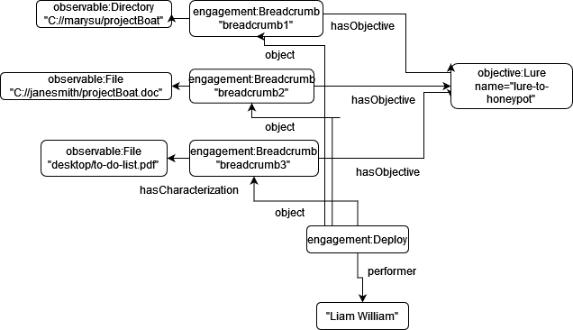

# Breadcrumb


```python
# This software was produced for the U.S. Government under contract FA8702-23-C-0001,
# and is subject to the Rights in Data-General Clause 52.227-14, Alt. IV (DEC 2007)
# ©2023 The MITRE Corporation. Published under the Linux Foundation’s Cyber Domain Ontology project’s Apache 2 license.
# Released under MITRE PRS 18-4297.
```

## Breadcrumb
This simple example outlines how to describe a simple and bare example of how to use the breadcrumb ae object and attach objectives to `lureObject(s)`.

In this example, you will see how to use:
- `engagement:Breadcrumb`





Additionally there is the `engagement:BreadcrumbTrail` object in case where the breadcrumbs themselves have some partial ordering. Alternatively, one can describe `engagement:Breadcrumb` with multiple `uco-core:UcoObject(s)` if all components as a whole is the breadcrumb concept.


```python
{
  "@context": {
    "co": "http://purl.org/co/",
    "kb": "http://example.org/kb/",
    "rdfs": "http://www.w3.org/2000/01/rdf-schema#",
    "uco-observable": "https://ontology.unifiedcyberontology.org/uco/observable/",
    "uco-core": "https://ontology.unifiedcyberontology.org/uco/core/",
    "uco-types": "https://ontology.unifiedcyberontology.org/uco/types/",
    "uco-identity": "https://ontology.unifiedcyberontology.org/uco/identity/",
    "uco-action": "https://ontology.unifiedcyberontology.org/uco/action/",
    "engagement": "https://ontology.adversaryengagement.org/ae/engagement/",
    "objective": "https://ontology.adversaryengagement.org/ae/objective/",
    "xsd": "http://www.w3.org/2001/XMLSchema#"
  },
  "@graph": [
    {
      "@id": "kb:bcdeployment1",
      "@type": "engagement:Deploy",
      "uco-action:performer": [
        {
          "@id": "kb:person1",
          "@type": "uco-identity:Person",
          "uco-core:hasFacet": [
            {
              "@id": "kb:LiamWilliam",
              "@type": "identity:SimpleNameFacet",
              "uco-identity:familyName": "Liam",
              "uco-identity:givenName": "William"
            }
          ],
          "uco-action:object": [
            {
              "@id": "kb:breadcrumb1",
              "@type": "engagement:Breadcrumb",
              "uco-core:description": "breadcrumb 1",
              "engagement:hasObjective": [
                {
                  "@id": "objective:Lure"
                }
              ],
			  "engagement:hasCharacterization": [
				{
				  "@id": "kb:dir1",
				  "@type": "uco-observable:Directory",
				  "uco-core:name": "C://marysu/projectBoat"
				}
			  
            },
            {
              "@id": "kb:breadcrumb2",
              "@type": "engagement:Breadcrumb",
              "uco-core:description": "breadcrumb 2",
              "engagement:hasObjective": [
                {
                  "@id": "objective:Lure"
                }
              ],
			  "engagement:hasCharacterization": [
				{
				  "@id": "kb:file1",
				  "@type": "uco-observable:File",
				  "uco-core:name": "projectBoat.doc",
				  "uco-core:hasFacet": [
					{
					  "@id": "kb:filefacet1",
					  "@type": "uco-observable:FileFacet",
					  "observable:filename": "projectBoat.doc"
					}
				  ]
				}
			  ]
            },
            {
              "@id": "kb:breadcrumb3",
              "@type": "engagement:Breadcrumb",
              "uco-core:description": "breadcrumb 3",
              "engagement:hasObjective": [
                {
                  "@id": "objective:Lure"
                }
              ],
			  "engagement:hasCharacterization": [
				{
				  "@id": "kb:file2",
				  "@type": "uco-observable:File",
				  "uco-core:name": "to-do-list.pdf",
				  "uco-core:hasFacet": [
					{
					  "@id": "kb:filefacet2",
					  "@type": "uco-observable:FileFacet",
					  "observable:filename": "to-do-list.pdf"
					}
				  ]
				}
			  ]
			  
			  
            }
          ]
        }
      ]
    }
  ]
}
```
