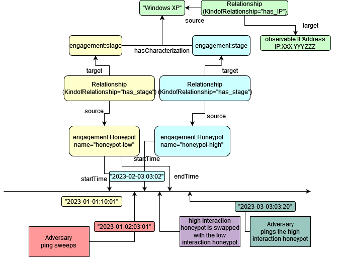

# Fluid Deception


```python
# This software was produced for the U.S. Government under contract FA8702-23-C-0001,
# and is subject to the Rights in Data-General Clause 52.227-14, Alt. IV (DEC 2007)
# ©2023 The MITRE Corporation. Published under the Linux Foundation’s Cyber Domain Ontology project’s Apache 2 license.
# Released under MITRE PRS 18-4297.
```

## Fluid Deception


This simple example outlines how to describe a simple and bare example of how the concept of the `engage:Stage` to maintain and persist an intended perception for an audience (e.g. an adversary). The example is designed for operational purposes in support of deception technologies rather than manual narration such as done with the `Narrative`/preplanning of a deception operation.

In this example, you will see how to use:
- `engagement:Honeypot` and its property `HoneypotInteractionType` ("high", "low", "dynamic")
- `engagement:Stage` for mutual perception



This example does not discuss whether to treat these honeypots as alias of one or another, this is case by case. With deception technologies and concepts such as fluid deception that attempt to reduce computational costs, it is important to be capable of documenting and describing operational events that are not necessarily thought to be of concern during preplanning. 


```python
{
  "@context": {
    "co": "http://purl.org/co/",
    "kb": "http://example.org/kb/",
    "rdfs": "http://www.w3.org/2000/01/rdf-schema#",
    "uco-observable": "https://ontology.unifiedcyberontology.org/uco/observable/",
    "uco-action": "https://ontology.unifiedcyberontology.org/uco/action/",
    "uco-core": "https://ontology.unifiedcyberontology.org/uco/core/",
    "uco-types": "https://ontology.unifiedcyberontology.org/uco/types/",
    "uco-identity": "https://ontology.unifiedcyberontology.org/uco/identity/",
    "engagement": "https://ontology.adversaryengagement.org/ae/engagement/",
    "objective": "https://ontology.adversaryengagement.org/ae/objective/",
    "xsd": "http://www.w3.org/2001/XMLSchema#"
  },
  "@graph": [
    {
      "@id": "kb:bcdeployment1",
      "@type": "engagement:Deploy",
      "uco-core:startTime": "2023-01-01:10:01",
      "uco-core:endTime": "2023-02-03:03:05",
      "uco-action:performer": [
        {
          "@id": "kb:person1",
          "@type": "uco-identity:Person",
          "uco-core:hasFacet": [
            {
              "@id": "kb:LiamWilliam",
              "@type": "identity:SimpleNameFacet",
              "uco-identity:familyName": "Liam",
              "uco-identity:givenName": "William"
            }
          ]
        }
      ],
      "uco-action:object": [
        {
          "@id": "kb:honeypot-low",
          "@type": "engagement:Honeypot",
          "engagement:honeypotInteractionType": "low"
        }
      ]
    },

    {
      "@id": "kb:honeypot-high",
      "@type": "engagement:Honeypot",
      "engagement:honeypotInteractionType": "high",
      "uco-core:startTime": "2023-02-03:03:02"
    },

    {
      "@id": "kb:relationship1",
      "@type": "uco-core:Relationship",
      "uco-core:kindofRelationship": "has_stage",
      "uco-core:source": [
        {
          "@id": "kb:honeypot-low",
          "@type": "engagement:Honeypot"
        }
      ],
      "uco-core:target": [
        {
          "@id": "kb:stage1"
        }
      ]
    },

    {
      "@id": "kb:relationship2",
      "@type": "uco-core:Relationship",
      "uco-core:kindofRelationship": "has_stage",
      "uco-core:source": [
        {
          "@id": "kb:honeypot-high",
          "@type": "engagement:Honeypot"
        }
      ],
      "uco-core:target": [
        {
          "@id": "kb:stage1"
        }
      ]
    },

    {
      "@id": "kb:stage1",
      "@type": "engagement:Stage",
      "engagement:hasCharacterization":
      [
        {
          "@id": "kb:device1",
          "@type": "uco-observable:Device",
          "uco-core:hasFacet": [
            {
              "@id": "kb:operatingsystemfacet1",
              "@type": "uco-observable:OperatingSystemFacet",
              "uco-core:name": "WindowsXP"
            },
            {
              "@id": "kb:networkinterfacefacet1",
              "@type": "uco-observable:NetworkInterfaceFacet",
              "uco-observable:ip": [
                {
                  "@id": "kb:ipaddress1",
                  "@type": "uco-observable:IPAddress",
                  "uco-core:hasFacet": [
                    {
                      "@id": "kb:ipaddressfacet1",
                      "@type": "uco-observable:IPAddressFacet",
                      "uco-observable:addressValue": "AAA.BBB.CCC.DDD"
                    }
                  ]
                }
              ]
            }
          ]
        }
      ]
    }
  ]
}

```


    {'@context': {'co': 'http://purl.org/co/',
      'kb': 'http://example.org/kb/',
      'rdfs': 'http://www.w3.org/2000/01/rdf-schema#',
      'uco-observable': 'https://ontology.unifiedcyberontology.org/uco/observable/',
      'uco-action': 'https://ontology.unifiedcyberontology.org/uco/action/',
      'uco-core': 'https://ontology.unifiedcyberontology.org/uco/core/',
      'uco-types': 'https://ontology.unifiedcyberontology.org/uco/types/',
      'uco-identity': 'https://ontology.unifiedcyberontology.org/uco/identity/',
      'engagement': 'https://ontology.adversaryengagement.org/ae/engagement/',
      'objective': 'https://ontology.adversaryengagement.org/ae/objective/',
      'xsd': 'http://www.w3.org/2001/XMLSchema#'},
     '@graph': [{'@id': 'kb:bcdeployment1',
       '@type': 'engagement:Deploy',
       'uco-core:startTime': '2023-01-01:10:01',
       'uco-core:endTime': '2023-02-03:03:05',
       'uco-action:performer': [{'@id': 'kb:person1',
         '@type': 'uco-identity:Person',
         'uco-core:hasFacet': [{'@id': 'kb:LiamWilliam',
           '@type': 'identity:SimpleNameFacet',
           'uco-identity:familyName': 'Liam',
           'uco-identity:givenName': 'William'}]}],
       'uco-action:object': [{'@id': 'kb:honeypot-low',
         '@type': 'engagement:Honeypot',
         'engagement:honeypotInteractionType': 'low'}]},
      {'@id': 'kb:honeypot-high',
       '@type': 'engagement:Honeypot',
       'engagement:honeypotInteractionType': 'high',
       'uco-core:startTime': '2023-02-03:03:02'},
      {'@id': 'kb:relationship1',
       '@type': 'uco-core:Relationship',
       'uco-core:kindofRelationship': 'has_stage',
       'uco-core:source': [{'@id': 'kb:honeypot-low',
         '@type': 'engagement:Honeypot'}],
       'uco-core:target': [{'@id': 'kb:stage1'}]},
      {'@id': 'kb:relationship2',
       '@type': 'uco-core:Relationship',
       'uco-core:kindofRelationship': 'has_stage',
       'uco-core:source': [{'@id': 'kb:honeypot-high',
         '@type': 'engagement:Honeypot'}],
       'uco-core:target': [{'@id': 'kb:stage1'}]},
      {'@id': 'kb:stage1',
       '@type': 'engagement:Stage',
       'engagement:hasCharacterization': [{'@id': 'kb:device1',
         '@type': 'uco-observable:Device',
         'uco-core:hasFacet': [{'@id': 'kb:operatingsystemfacet1',
           '@type': 'uco-observable:OperatingSystemFacet',
           'uco-core:name': 'WindowsXP'},
          {'@id': 'kb:networkinterfacefacet1',
           '@type': 'uco-observable:NetworkInterfaceFacet',
           'uco-observable:ip': [{'@id': 'kb:ipaddress1',
             '@type': 'uco-observable:IPAddress',
             'uco-core:hasFacet': [{'@id': 'kb:ipaddressfacet1',
               '@type': 'uco-observable:IPAddressFacet',
               'uco-observable:addressValue': 'AAA.BBB.CCC.DDD'}]}]}]}]}]}


```python

```
