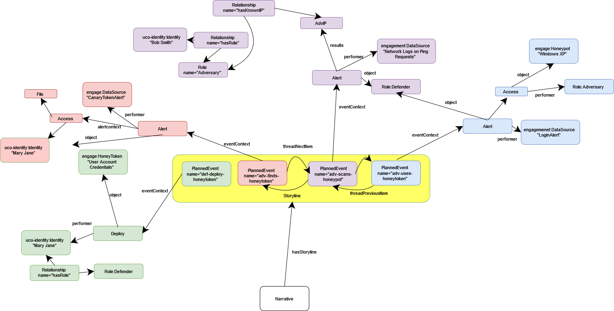
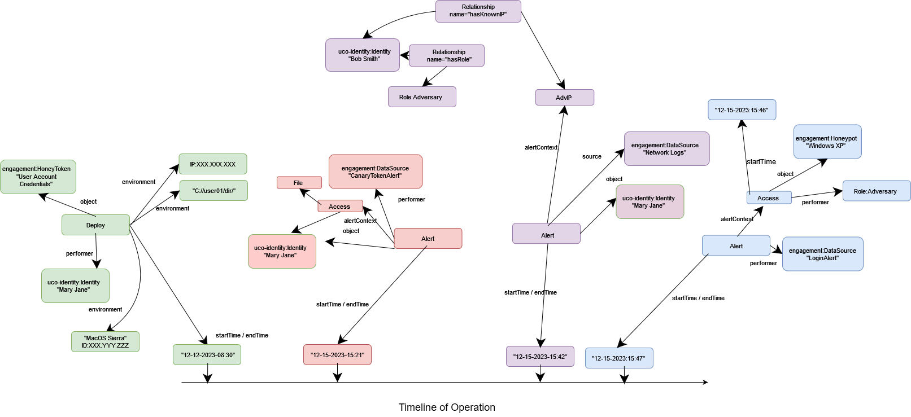

# Honeypot

<!--- # NOTICE

# This software was produced for the U.S. Government under contract FA8702-23-C-0001,

# and is subject to the Rights in Data-General Clause 52.227-14, Alt. IV (DEC 2007)

# ©2023 The MITRE Corporation. Published under the Linux Foundation’s Cyber Domain Ontology project’s Apache 2 license.

# Released under MITRE PRS 18-4297.
-->


This simple example outlines how to describe a simple and bare example of planning a honeypot deception operation.

In the `Narrative` example, you will see how to narrative and story concepts such as:
- `engagement:Narrative`
- `engagement:Storyline`
- `engagement:PlannedEvent`

There are additional concepts such as `engagement:stageAttackSurface` which allows specific attack surfaces to be described by UCO objects.
	
Each `PlannedEvent` has an `eventContext` ObjectProperty that directly connects to an action class from the uco's base class `Action` such as:
- `engagement:Alert`
- `engagement:Access`
	
The UCO `action` has properties which we are interested in:
- `performer` - the `Identity` that performs the action
- `object` - the `UcoObject` of which the action is applied upon or to.

The class `engagement:Alert` has an `alertContext` ObjectProperty that is used to describe the contents of an alert between two identities or objects.





```python
{
  "@context": {
    "co": "http://purl.org/co/",
    "engagement": "https://ontology.adversaryengagement.org/ae/engagement/",
    "objective": "https://ontology.adversaryengagement.org/ae/objective/",
    "role": "https://ontology.adversaryengagement.org/ae/role/",
    "kb": "http://example.org/kb/",
    "rdfs": "http://www.w3.org/2000/01/rdf-schema#",
    "uco-action": "https://ontology.unifiedcyberontology.org/uco/action/",
    "uco-core": "https://ontology.unifiedcyberontology.org/uco/core/",
    "uco-identity": "https://ontology.unifiedcyberontology.org/uco/identity/",
    "uco-observable": "https://ontology.unifiedcyberontology.org/uco/observable/",
    "uco-types": "https://ontology.unifiedcyberontology.org/uco/types/",
    "xsd": "http://www.w3.org/2001/XMLSchema#"
  },
  "@graph": [
    {
      "@id": "kb:narrative1",
      "@type": "engagement:Narrative",
      "engagement:hasStoryline": [
        {
          "@id": "kb:storyline1",
          "@type": "engagement:Storyline",
          "uco-core:name": "story1"
        }
      ],
      "objective:hasObjective": [
        {
          "@id": "kb:objective1",
          "@type": "objective:Objective",
          "uco-core:name": "Grand objective is to lure known adversary on network to specific honeypot."
        }
      ],
      "uco-core:description": "The identifiable name of the deception campaign."
    },
    {
      "@id": "kb:Event1",
      "@type": "engagement:PlannedEvent",
      "engagement:eventContext": [
        {
          "@id": "kb:deploy1",
          "@type": "engagement:Deploy",
          "uco-action:object": [
            {
              "@id": "kb:honeytoken1",
              "@type": "engagement:HoneyToken",
              "uco-core:description": "Honeytoken credentials to a honeypot."
            }
          ],
          "uco-action:performer": [
            {
              "@id": "kb:person1",
              "@type": "uco-identity:Person",
              "uco-core:hasFacet": [
                {
                  "@id": "kb:MaryJane",
                  "@type": "identity:SimpleNameFacet",
                  "uco-identity:familyName": "Mary",
                  "uco-identity:givenName": "Jane"
                }
              ]
            }
          ]
        }
      ],
      "objective:hasObjective": [
        {
          "@id": "objective:Deploy"
        }
      ],
      "uco-core:name": "def-deploy-honeytoken"
    },
    {
      "@id": "kb:Event2",
      "@type": "engagement:PlannedEvent",
      "engagement:eventContext": [
        {
          "@id": "kb:alert1",
          "@type": "engagement:Alert",
          "engagement:alertContext": [
            {
              "@id": "kb:access1",
              "@type": "engagement:Access",
              "uco-action:object": [
                {
                  "@id": "kb:honeytoken1"
                },
                {
                  "@id": "kb:file1",
                  "@type": "uco-observable:File",
                  "uco-core:name": "saved-login-creds.txt",
                  "uco-core:hasFacet": [
                    {
                      "@id": "kb:filefacet1",
                      "@type": "uco-observable:FileFacet",
                      "observable:filename": "saved-login-creds.txt"
                    }
                  ]
                }
              ],
              "uco-action:performer": [
                {
                  "@id": "role:Adversary"
                }
              ]
            }
          ],
          "uco-action:object": [
            {
              "@id": "role:Defender"
            }
          ],
          "uco-action:performer": [
            {
              "@id": "kb:DataSource1",
              "@type": "engagement:DataSource",
              "uco-core:name": "CanaryTokenAlert"
            }
          ]
        }
      ],
      "objective:hasObjective": [
        {
          "@id": "objective:Detect"
        }
      ],
      "uco-core:name": "adv-finds-honeytoken"
    },
    {
      "@id": "kb:Event3",
      "@type": "engagement:PlannedEvent",
      "engagement:eventContext": [
        {
          "@id": "kb:alert2",
          "@type": "engagement:Alert",
          "engagement:alertContext": [
            {
              "@id": "kb:ipaddress1",
              "@type": "uco-observable:IPv6Address",
              "uco-core:name": "known-adversary-ip"
            }
          ],
          "uco-action:object": [
            {
              "@id": "role:Defender"
            }
          ],
          "uco-action:performer": [
            {
              "@id": "kb:DataSource2",
              "@type": "engagement:DataSource",
              "uco-core:name": "NetworkAlert"
            }
          ]
        }
      ],
      "objective:hasObjective": [
        {
          "@id": "objective:Detect"
        }
      ],
      "uco-core:name": "adv-scans-honeypot"
    },
    {
      "@id": "kb:Event4",
      "@type": "engagement:PlannedEvent",
      "engagement:eventContext": [
        {
          "@id": "kb:alert3",
          "@type": "engagement:Alert",
          "engagement:alertContext": [
            {
              "@id": "kb:access2",
              "@type": "engagement:Access",
              "uco-action:object": [
                {
                  "@id": "kb:honeypot1",
                  "@type": "engagement:Honeypot",
                  "uco-core:name": "Windows XP"
                }
              ],
              "uco-action:performer": [
                {
                  "@id": "role:Adversary"
                }
              ],
              "uco-core:instrument": [
                {
                  "@id": "kb:honeytoken1",
                  "@type": "engagement:honeyToken"
                }
              ]
            }
          ],
          "uco-action:object": [
            {
              "@id": "role:Defender"
            }
          ],
          "uco-action:performer": [
            {
              "@id": "kb:DataSource3",
              "@type": "engagement:DataSource",
              "uco-core:name": "LoginAlert"
            }
          ]
        }
      ],
      "objective:hasObjective": [
        {
          "@id": "objective:Detect"
        }
      ],
      "uco-core:name": "adv-accesses-honeypot-with-honeytoken"
    },
    {
      "@id": "kb:storyline1",
      "@type": "engagement:Storyline",
      "engagement:hasEvent": [
        {
          "@id": "kb:eventthread1",
          "@type": "uco-types:Thread",
          "co:element": [
            {
              "@id": "kb:Event1"
            },
            {
              "@id": "kb:Event2"
            },
            {
              "@id": "kb:Event3"
            },
            {
              "@id": "kb:Event4"
            }
          ],
          "co:item": [
            {
              "@id": "kb:event-thread-item1"
            },
            {
              "@id": "kb:event-thread-item2"
            },
            {
              "@id": "kb:event-thread-item3"
            },
            {
              "@id": "kb:event-thread-item4"
            }
          ],
          "co:size": {
            "@type": "xsd:nonNegativeInteger",
            "@value": "4"
          },
          "uco-types:threadOriginItem": [
            {
              "@id": "kb:event-thread-item1"
            }
          ],
          "uco-types:threadTerminalItem": [
            {
              "@id": "kb:event-thread-item4"
            }
          ]
        }
      ]
    },
    {
      "@id": "kb:event-thread-item1",
      "@type": "uco-types:ThreadItem",
      "co:itemContent": {
        "@id": "kb:Event1"
      },
      "uco-types:threadNextItem": [
        {
          "@id": "kb:event-thread-item2"
        }
      ]
    },
    {
      "@id": "kb:event-thread-item2",
      "@type": "uco-types:ThreadItem",
      "co:itemContent": {
        "@id": "kb:Event2"
      },
      "uco-types:threadNextItem": [
        {
          "@id": "kb:event-thread-item3"
        }
      ],
      "uco-types:threadPreviousItem": [
        {
          "@id": "kb:event-thread-item1"
        }
      ]
    },
    {
      "@id": "kb:event-thread-item3",
      "@type": "uco-types:ThreadItem",
      "co:itemContent": {
        "@id": "kb:Event3"
      },
      "uco-types:threadNextItem": [
        {
          "@id": "kb:event-thread-item4"
        }
      ],
      "uco-types:threadPreviousItem": {
        "@id": "kb:event-thread-item2"
      }
    },
    {
      "@id": "kb:event-thread-item4",
      "@type": "uco-types:ThreadItem",
      "co:itemContent": {
        "@id": "kb:Event4"
      },
      "uco-types:threadPreviousItem": {
        "@id": "kb:event-thread-item3"
      }
    }
  ]
}

```


    {'@context': {'co': 'http://purl.org/co/',
      'engagement': 'https://ontology.adversaryengagement.org/ae/engagement/',
      'objective': 'https://ontology.adversaryengagement.org/ae/objective/',
      'role': 'https://ontology.adversaryengagement.org/ae/role/',
      'kb': 'http://example.org/kb/',
      'rdfs': 'http://www.w3.org/2000/01/rdf-schema#',
      'uco-action': 'https://ontology.unifiedcyberontology.org/uco/action/',
      'uco-core': 'https://ontology.unifiedcyberontology.org/uco/core/',
      'uco-identity': 'https://ontology.unifiedcyberontology.org/uco/identity/',
      'uco-observable': 'https://ontology.unifiedcyberontology.org/uco/observable/',
      'uco-types': 'https://ontology.unifiedcyberontology.org/uco/types/',
      'xsd': 'http://www.w3.org/2001/XMLSchema#'},
     '@graph': [{'@id': 'kb:narrative1',
       '@type': 'engagement:Narrative',
       'engagement:hasStoryline': [{'@id': 'kb:storyline1',
         '@type': 'engagement:Storyline',
         'uco-core:name': 'story1'}],
       'objective:hasObjective': [{'@id': 'kb:objective1',
         '@type': 'objective:Objective',
         'uco-core:name': 'Grand objective is to lure known adversary on network to specific honeypot.'}],
       'uco-core:description': 'The identifiable name of the deception campaign.'},
      {'@id': 'kb:Event1',
       '@type': 'engagement:PlannedEvent',
       'engagement:eventContext': [{'@id': 'kb:deploy1',
         '@type': 'engagement:Deploy',
         'uco-action:object': [{'@id': 'kb:honeytoken1',
           '@type': 'engagement:HoneyToken',
           'uco-core:description': 'Honeytoken credentials to a honeypot.'}],
         'uco-action:performer': [{'@id': 'kb:person1',
           '@type': 'uco-identity:Person',
           'uco-core:hasFacet': [{'@id': 'kb:MaryJane',
             '@type': 'identity:SimpleNameFacet',
             'uco-identity:familyName': 'Mary',
             'uco-identity:givenName': 'Jane'}]}]}],
       'objective:hasObjective': [{'@id': 'objective:Deploy'}],
       'uco-core:name': 'def-deploy-honeytoken'},
      {'@id': 'kb:Event2',
       '@type': 'engagement:PlannedEvent',
       'engagement:eventContext': [{'@id': 'kb:alert1',
         '@type': 'engagement:Alert',
         'engagement:alertContext': [{'@id': 'kb:access1',
           '@type': 'engagement:Access',
           'uco-action:object': [{'@id': 'kb:honeytoken1'},
            {'@id': 'kb:file1',
             '@type': 'uco-observable:File',
             'uco-core:name': 'saved-login-creds.txt',
             'uco-core:hasFacet': [{'@id': 'kb:filefacet1',
               '@type': 'uco-observable:FileFacet',
               'observable:filename': 'saved-login-creds.txt'}]}],
           'uco-action:performer': [{'@id': 'role:Adversary'}]}],
         'uco-action:object': [{'@id': 'role:Defender'}],
         'uco-action:performer': [{'@id': 'kb:DataSource1',
           '@type': 'engagement:DataSource',
           'uco-core:name': 'CanaryTokenAlert'}]}],
       'objective:hasObjective': [{'@id': 'objective:Detect'}],
       'uco-core:name': 'adv-finds-honeytoken'},
      {'@id': 'kb:Event3',
       '@type': 'engagement:PlannedEvent',
       'engagement:eventContext': [{'@id': 'kb:alert2',
         '@type': 'engagement:Alert',
         'engagement:alertContext': [{'@id': 'kb:ipaddress1',
           '@type': 'uco-observable:IPv6Address',
           'uco-core:name': 'known-adversary-ip'}],
         'uco-action:object': [{'@id': 'role:Defender'}],
         'uco-action:performer': [{'@id': 'kb:DataSource2',
           '@type': 'engagement:DataSource',
           'uco-core:name': 'NetworkAlert'}]}],
       'objective:hasObjective': [{'@id': 'objective:Detect'}],
       'uco-core:name': 'adv-scans-honeypot'},
      {'@id': 'kb:Event4',
       '@type': 'engagement:PlannedEvent',
       'engagement:eventContext': [{'@id': 'kb:alert3',
         '@type': 'engagement:Alert',
         'engagement:alertContext': [{'@id': 'kb:access2',
           '@type': 'engagement:Access',
           'uco-action:object': [{'@id': 'kb:honeypot1',
             '@type': 'engagement:Honeypot',
             'uco-core:name': 'Windows XP'}],
           'uco-action:performer': [{'@id': 'role:Adversary'}],
           'uco-core:instrument': [{'@id': 'kb:honeytoken1',
             '@type': 'engagement:honeyToken'}]}],
         'uco-action:object': [{'@id': 'role:Defender'}],
         'uco-action:performer': [{'@id': 'kb:DataSource3',
           '@type': 'engagement:DataSource',
           'uco-core:name': 'LoginAlert'}]}],
       'objective:hasObjective': [{'@id': 'objective:Detect'}],
       'uco-core:name': 'adv-accesses-honeypot-with-honeytoken'},
      {'@id': 'kb:storyline1',
       '@type': 'engagement:Storyline',
       'engagement:hasEvent': [{'@id': 'kb:eventthread1',
         '@type': 'uco-types:Thread',
         'co:element': [{'@id': 'kb:Event1'},
          {'@id': 'kb:Event2'},
          {'@id': 'kb:Event3'},
          {'@id': 'kb:Event4'}],
         'co:item': [{'@id': 'kb:event-thread-item1'},
          {'@id': 'kb:event-thread-item2'},
          {'@id': 'kb:event-thread-item3'},
          {'@id': 'kb:event-thread-item4'}],
         'co:size': {'@type': 'xsd:nonNegativeInteger', '@value': '4'},
         'uco-types:threadOriginItem': [{'@id': 'kb:event-thread-item1'}],
         'uco-types:threadTerminalItem': [{'@id': 'kb:event-thread-item4'}]}]},
      {'@id': 'kb:event-thread-item1',
       '@type': 'uco-types:ThreadItem',
       'co:itemContent': {'@id': 'kb:Event1'},
       'uco-types:threadNextItem': [{'@id': 'kb:event-thread-item2'}]},
      {'@id': 'kb:event-thread-item2',
       '@type': 'uco-types:ThreadItem',
       'co:itemContent': {'@id': 'kb:Event2'},
       'uco-types:threadNextItem': [{'@id': 'kb:event-thread-item3'}],
       'uco-types:threadPreviousItem': [{'@id': 'kb:event-thread-item1'}]},
      {'@id': 'kb:event-thread-item3',
       '@type': 'uco-types:ThreadItem',
       'co:itemContent': {'@id': 'kb:Event3'},
       'uco-types:threadNextItem': [{'@id': 'kb:event-thread-item4'}],
       'uco-types:threadPreviousItem': {'@id': 'kb:event-thread-item2'}},
      {'@id': 'kb:event-thread-item4',
       '@type': 'uco-types:ThreadItem',
       'co:itemContent': {'@id': 'kb:Event4'},
       'uco-types:threadPreviousItem': {'@id': 'kb:event-thread-item3'}}]}


In the `Operational` example, you will see how operational events pan out that leverage other `UcoObject` properties such as:
- `startTime`
- `endTime`
	
There are tradeoffs between merging the `PlannedEvent(s)` from the narrative and planning phase of an operation with reports from its operation.
1. Merging events with `PlannedEvents` can allow users to determine how successful an operation followed a storyline
2. Keeping events separated can allow users to fully scope the duration of a deception from its conception to its analysis if desired




```python
{
  "@context": {
    "co": "http://purl.org/co/",
    "kb": "http://example.org/kb/",
    "rdfs": "http://www.w3.org/2000/01/rdf-schema#",
    "uco-identity": "https://ontology.unifiedcyberontology.org/uco/identity/",
    "uco-action": "https://ontology.unifiedcyberontology.org/uco/action/",
    "uco-core": "https://ontology.unifiedcyberontology.org/uco/core/",
    "uco-observable": "https://ontology.unifiedcyberontology.org/uco/observable/",
    "uco-types": "https://ontology.unifiedcyberontology.org/uco/types/",
    "engagement": "https://ontology.adversaryengagement.org/ae/engagement/",
    "role": "https://ontology.adversaryengagement.org/ae/role/",
    "xsd": "http://www.w3.org/2001/XMLSchema#"
  },
  "@graph": [
    {
      "@id": "kb:deployinstance1",
      "@type": "engagement:Deploy",
      "uco-core:startTime": "12-12-2023-08:30",
      "uco-action:performer": [
        {
          "@id": "kb:person1",
          "@type": "uco-identity:Person",
          "uco-core:hasFacet": [
            {
              "@id": "kb:MaryJane",
              "@type": "identity:SimpleNameFacet",
              "uco-identity:familyName": "Mary",
              "uco-identity:givenName": "Jane"
            }
          ]
        }
      ],
      "uco-action:object": [
        {
          "@id": "kb:honeytoken1",
          "@type": "engagement:HoneyToken",
          "uco-core:description": "Honeytoken credentials to a honeypot."
        }
      ],
      "uco-action:environment": [
        {
          "@id": "kb:device1",
          "@type": "uco-observable:Device",
          "uco-core:hasFacet": [
            {
              "@id": "kb:operatingsystemfacet1",
              "@type": "uco-observable:OperatingSystemFacet",
              "uco-core:name": "WindowsXP"
            },
            {
              "@id": "kb:networkinterfacefacet1",
              "@type": "uco-observable:NetworkInterfaceFacet",
              "uco-observable:ip": [
                {
                  "@id": "kb:ipaddress1",
                  "@type": "uco-observable:IPAddress",
                  "uco-core:hasFacet": [
                    {
                      "@id": "kb:ipaddressfacet1",
                      "@type": "uco-observable:IPAddressFacet",
                      "uco-observable:addressValue": "AAA.BBB.CCC.DDD"
                    }
                  ]
                }
              ]
            }
          ]
        }
      ]
    },

    {
      "@id": "kb:alert1",
      "@type": "engagement:Alert",
      "uco-core:startTime": "12-15-2023-15:21",
      "uco-action:performer": [
        {
          "@id": "kb:datasource1",
          "@type": "engagement:DataSource",
          "uco-core:name": "CanaryTokenAlert"
        }
      ],
      "uco-action:object": [
        {
          "@id": "role:Defender"
        }
      ],
      "engagement:alertContext": [
        {
          "@id": "kb:accessinstance1",
          "@type": "engagement:Access",
          "uco-action:performer": [
            {
              "@id": "role:Adversary"
            }
          ],
          "uco-action:object": [
            {
              "@id": "kb:honeytoken1",
              "@type": "engagement:honeyToken"
            },
            {
              "@id": "kb:file1",
              "@type": "uco-observable:File",
              "uco-core:name": "saved-login-creds.txt",
              "uco-core:hasFacet": [
                {
                  "@id": "kb:filefacet1",
                  "@type": "uco-observable:FileFacet",
                  "observable:filename": "saved-login-creds.txt"
                }
              ]
            }
          ]
        }
      ]
    },

    {
      "@id": "kb:alert2",
      "@type": "engagement:Alert",
      "uco-core:startTime": "12-15-2023-15:42",
      "uco-action:performer": [
        {
          "@id": "kb:datasource2",
          "@type": "engagement:DataSource",
          "uco-core:name": "NetworkAlert"
        }
      ],
      "uco-action:object": [
        {
          "@id": "role:Defender"
        }
      ],
      "engagement:alertContext": [
        {
          "@id": "kb:ipaddress2",
          "@type": "uco-observable:IPv6Address",
          "uco-core:hasFacet": [
            {
              "@id": "kb:ipaddressfacet2",
              "@type": "uco-observable:IPv6AddressFacet",
              "uco-observable:addressValue": "<known-adversary-ip>"
            }
          ]
        }
      ]
    },

    {
      "@id": "kb:accessinstance2",
      "@type": "engagement:Access",
      "uco-action:performer": [
        {
          "@id": "role:Adversary"
        }
      ],
      "uco-action:object": [
        {
          "@id": "kb:honeypot1",
          "@type": "engagement:Honeypot",
          "uco-core:name": "Windows XP"
        }
      ],
      "uco-action:instrument": [
        {
          "@id": "kb:honeytoken1",
          "@type": "engagement:honeyToken"
        }
      ]
    }
  ]
}
```


    {'@context': {'co': 'http://purl.org/co/',
      'kb': 'http://example.org/kb/',
      'rdfs': 'http://www.w3.org/2000/01/rdf-schema#',
      'uco-identity': 'https://ontology.unifiedcyberontology.org/uco/identity/',
      'uco-action': 'https://ontology.unifiedcyberontology.org/uco/action/',
      'uco-core': 'https://ontology.unifiedcyberontology.org/uco/core/',
      'uco-observable': 'https://ontology.unifiedcyberontology.org/uco/observable/',
      'uco-types': 'https://ontology.unifiedcyberontology.org/uco/types/',
      'engagement': 'https://ontology.adversaryengagement.org/ae/engagement/',
      'role': 'https://ontology.adversaryengagement.org/ae/role/',
      'xsd': 'http://www.w3.org/2001/XMLSchema#'},
     '@graph': [{'@id': 'kb:deployinstance1',
       '@type': 'engagement:Deploy',
       'uco-core:startTime': '12-12-2023-08:30',
       'uco-action:performer': [{'@id': 'kb:person1',
         '@type': 'uco-identity:Person',
         'uco-core:hasFacet': [{'@id': 'kb:MaryJane',
           '@type': 'identity:SimpleNameFacet',
           'uco-identity:familyName': 'Mary',
           'uco-identity:givenName': 'Jane'}]}],
       'uco-action:object': [{'@id': 'kb:honeytoken1',
         '@type': 'engagement:HoneyToken',
         'uco-core:description': 'Honeytoken credentials to a honeypot.'}],
       'uco-action:environment': [{'@id': 'kb:device1',
         '@type': 'uco-observable:Device',
         'uco-core:hasFacet': [{'@id': 'kb:operatingsystemfacet1',
           '@type': 'uco-observable:OperatingSystemFacet',
           'uco-core:name': 'WindowsXP'},
          {'@id': 'kb:networkinterfacefacet1',
           '@type': 'uco-observable:NetworkInterfaceFacet',
           'uco-observable:ip': [{'@id': 'kb:ipaddress1',
             '@type': 'uco-observable:IPAddress',
             'uco-core:hasFacet': [{'@id': 'kb:ipaddressfacet1',
               '@type': 'uco-observable:IPAddressFacet',
               'uco-observable:addressValue': 'AAA.BBB.CCC.DDD'}]}]}]}]},
      {'@id': 'kb:alert1',
       '@type': 'engagement:Alert',
       'uco-core:startTime': '12-15-2023-15:21',
       'uco-action:performer': [{'@id': 'kb:datasource1',
         '@type': 'engagement:DataSource',
         'uco-core:name': 'CanaryTokenAlert'}],
       'uco-action:object': [{'@id': 'role:Defender'}],
       'engagement:alertContext': [{'@id': 'kb:accessinstance1',
         '@type': 'engagement:Access',
         'uco-action:performer': [{'@id': 'role:Adversary'}],
         'uco-action:object': [{'@id': 'kb:honeytoken1',
           '@type': 'engagement:honeyToken'},
          {'@id': 'kb:file1',
           '@type': 'uco-observable:File',
           'uco-core:name': 'saved-login-creds.txt',
           'uco-core:hasFacet': [{'@id': 'kb:filefacet1',
             '@type': 'uco-observable:FileFacet',
             'observable:filename': 'saved-login-creds.txt'}]}]}]},
      {'@id': 'kb:alert2',
       '@type': 'engagement:Alert',
       'uco-core:startTime': '12-15-2023-15:42',
       'uco-action:performer': [{'@id': 'kb:datasource2',
         '@type': 'engagement:DataSource',
         'uco-core:name': 'NetworkAlert'}],
       'uco-action:object': [{'@id': 'role:Defender'}],
       'engagement:alertContext': [{'@id': 'kb:ipaddress2',
         '@type': 'uco-observable:IPv6Address',
         'uco-core:hasFacet': [{'@id': 'kb:ipaddressfacet2',
           '@type': 'uco-observable:IPv6AddressFacet',
           'uco-observable:addressValue': '<known-adversary-ip>'}]}]},
      {'@id': 'kb:accessinstance2',
       '@type': 'engagement:Access',
       'uco-action:performer': [{'@id': 'role:Adversary'}],
       'uco-action:object': [{'@id': 'kb:honeypot1',
         '@type': 'engagement:Honeypot',
         'uco-core:name': 'Windows XP'}],
       'uco-action:instrument': [{'@id': 'kb:honeytoken1',
         '@type': 'engagement:honeyToken'}]}]}


```python

```
